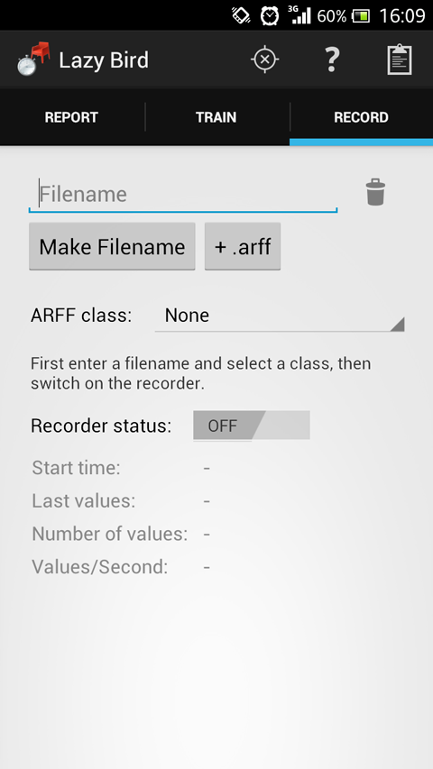
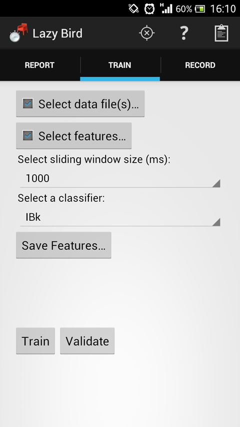
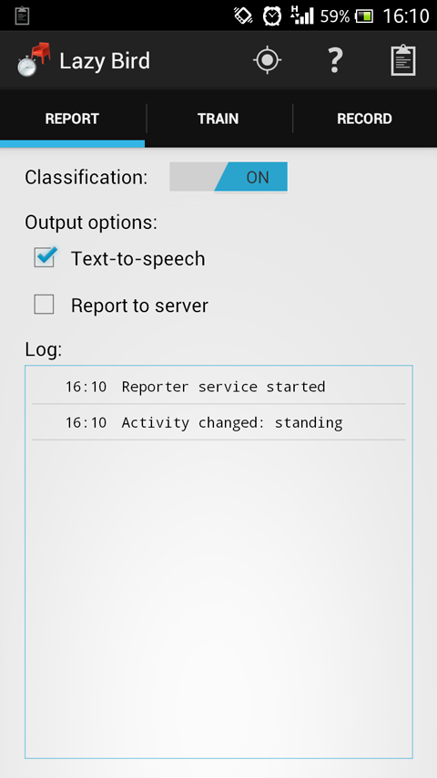
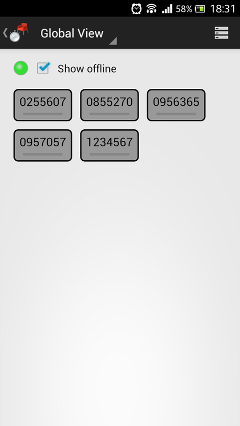
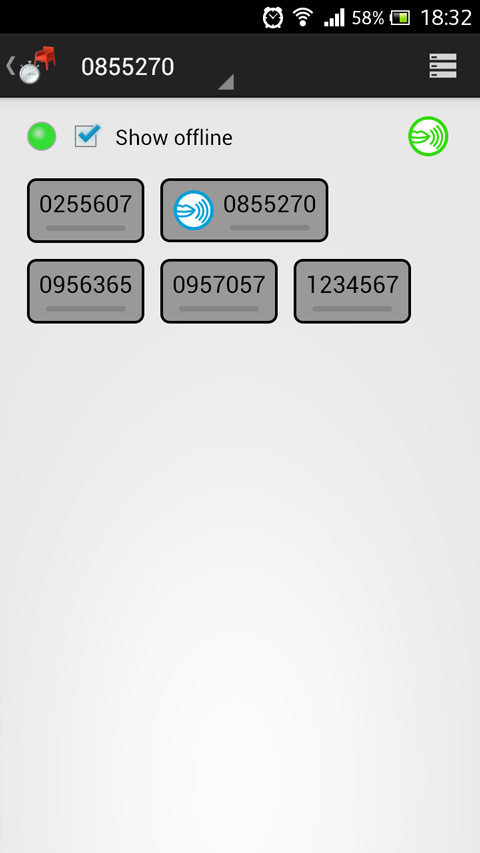
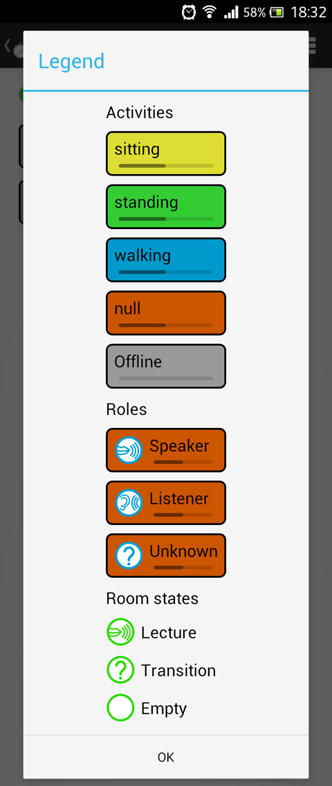
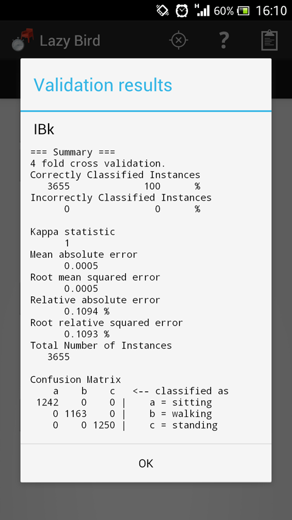
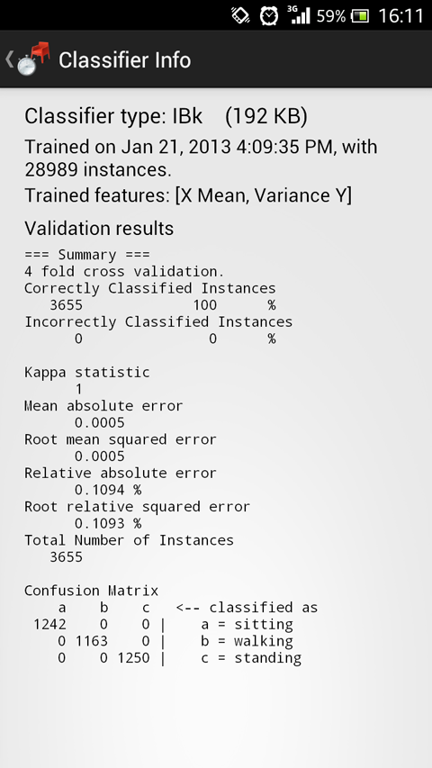

# Introduction

Here is a quick overview of the user interface with a basic description.

# Screenshots

The three main tabs, _Record_, _Train_ and _Report_. This is where you can
record accelerometer data, extract features to train a classifier, and classify
and report your activity to a server.

In the _Live View_, you can see who is connected to the server and what their
current activity is. The second image shows the user dependent mode, where you
can see the roles and room state as determined by that particular user.

The _Live View_ also has a legend, to help you with the different colors and
symbols.

After training a classifier you can perform a cross-validation. The results are
displayed and also stored for display along with additional information about
the current classifier.

